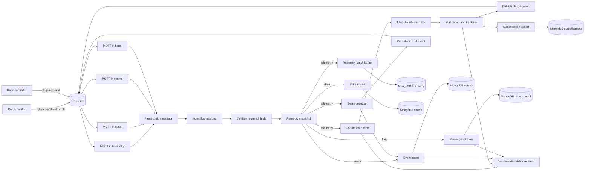
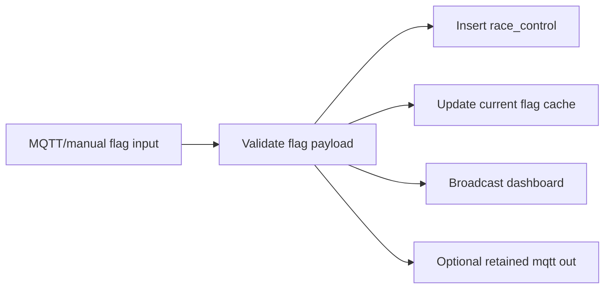

# Node-RED Flow Architecture

Documento di riferimento per la Fase 5 del piano di implementazione.
Definisce l'architettura logica dei flow Node-RED prima della loro
implementazione in `node-red/data/flows.json`.

Obiettivo: tenere Node-RED come processing layer centrale tra MQTT, MongoDB e
dashboard, separando ingestione, normalizzazione, calcolo real-time,
persistenza e broadcast UI.

---

## 1. Flow diagram



---

## 2. Tab Node-RED previsti

| Tab | Responsabilita | Nodi principali |
|---|---|---|
| `01-mqtt-ingest` | Ricezione MQTT e routing iniziale | `mqtt in`, `switch`, `link out` |
| `02-normalize-validate` | Parsing topic, normalizzazione timestamp, controllo campi minimi | `function`, `json`, `switch`, `catch` |
| `03-telemetry-processing` | Cache auto, anomaly detection, calcolo classifica 1 Hz | `function`, `trigger`, `link call` |
| `04-persistence` | Scritture MongoDB batch/upsert | `mongodb out`, `function`, `delay` |
| `05-race-control` | Gestione flag ricevute e comandi manuali dashboard | `mqtt in`, `mqtt out`, `function` |
| `06-dashboard-feed` | Stream dati verso dashboard | `websocket out` oppure dashboard nodes |
| `99-errors-monitoring` | Error handling e debug mirato | `catch`, `status`, `debug` |

Separare i tab riduce il rumore visivo e permette di esportare o testare
singole parti senza mischiare responsabilita diverse.

---

## 3. Contratto interno dei messaggi

Dopo il nodo `Normalize payload`, ogni messaggio deve avere questa forma:

```json
{
  "kind": "telemetry",
  "raceId": 1,
  "teamId": "ferrari",
  "carId": 16,
  "topic": "f1/simulation/1/teams/ferrari/cars/16/telemetry",
  "timestamp": "2026-04-27T14:32:10.512Z",
  "payload": {}
}
```

Valori ammessi di `kind`:

| kind | Origine MQTT | Destinazioni |
|---|---|---|
| `telemetry` | `.../cars/{carId}/telemetry` | cache, batch MongoDB, event detection, dashboard |
| `state` | `.../cars/{carId}/state` | upsert `states`, dashboard |
| `event` | `.../cars/{carId}/events` | insert `events`, dashboard |
| `flag` | `.../race-control/flags` | insert `race_control`, dashboard, cache flag |
| `classification` | `.../race-control/classification` | dashboard, optional store |

La normalizzazione deve derivare `raceId`, `teamId`, `carId` e `kind` dal
topic quando possibile, poi confrontarli con il payload per intercettare
messaggi incoerenti.

---

## 4. Subflow riusabili

| Subflow | Input | Output | Note |
|---|---|---|---|
| `sf-parse-f1-topic` | `msg.topic` | `msg.meta` | Estrae raceId/teamId/carId/kind con split dei segmenti topic. |
| `sf-normalize-document` | `msg.payload`, `msg.meta` | `msg.doc` | Converte timestamp in ISO string per MQTT/dashboard e in `Date` per Mongo. |
| `sf-mongo-batch-insert` | `msg.doc` | batch docs | Buffer per telemetria, flush ogni 100 record o 1 secondo. |
| `sf-upsert-by-race-car` | `msg.doc` | query/update | Usato per `states` con chiave `(raceId, carId)`. |
| `sf-dashboard-envelope` | evento interno | payload UI | Uniforma stream WebSocket: `{type, raceId, data}`. |

---

## 5. Cache e context Node-RED

La classifica non va calcolata interrogando MongoDB a ogni tick: Node-RED deve
mantenere una cache volatile aggiornata dalla telemetria.

| Key context | Scope | Contenuto | TTL logico |
|---|---|---|---|
| `race.<raceId>.cars` | flow | ultimo sample per `carId` | reset a nuova gara |
| `race.<raceId>.states` | flow | ultimo stato FSM per `carId` | reset a nuova gara |
| `race.<raceId>.flag` | flow | flag corrente | fino a cambio flag |
| `race.<raceId>.lastEvents` | flow | dedup anomaly/eventi derivati | 5-10 s |
| `race.<raceId>.lastClassification` | flow | ultimo snapshot classifica | 1 s |

La cache e' volatile: MongoDB rimane la fonte storica, mentre MQTT retained
copre il ripristino rapido di stato, flag e classifica per dashboard e
subscriber tardivi.

---

## 6. Calcolo classifica

Il flow `03-telemetry-processing` esegue un tick a 1 Hz:

1. Legge `race.<raceId>.cars`.
2. Scarta auto senza telemetria recente o con stato non valido.
3. Ordina per `lap` decrescente e poi `trackPos` decrescente.
4. Assegna `position`.
5. Calcola `gap` con una stima semplice basata su distanza normalizzata dal
   leader e velocita media recente.
6. Pubblica lo snapshot su
   `f1/simulation/{raceId}/race-control/classification` con QoS 1 retained.
7. Upsert dello snapshot in `classifications`.
8. Invia lo stesso snapshot alla dashboard.

Questa scelta mantiene bassa la latenza e limita il carico: il dato ad alta
frequenza aggiorna la cache, mentre la classifica viene prodotta a frequenza
controllata.

---

## 7. Event detection

Il nodo `Event detection` lavora solo sui messaggi `telemetry` e genera eventi
derivati quando vengono superate soglie configurabili:

| Condizione | Evento generato | Dedup |
|---|---|---|
| temperatura gomma oltre soglia critica | `fault` o `state-change` candidato | per auto e tipo, 10 s |
| carburante sotto soglia warning | `state-change` candidato | per auto e tipo, 30 s |
| velocita zero persistente in `RUNNING` | `retirement` candidato | dopo finestra temporale |
| salto anomalo di `trackPos` | `sector-completed` oppure anomaly debug | per auto e giro |

Gli eventi derivati seguono lo schema `event.schema.json`, vengono scritti in
MongoDB e, se rilevanti per altri componenti, ripubblicati sul topic events
dell'auto.

---

## 8. Race control flow

Il flow `05-race-control` ha due ingressi:

- MQTT retained `f1/simulation/{raceId}/race-control/flags`, prodotto dal
  simulatore o da controlli manuali.
- Comandi manuali dalla dashboard, normalizzati nello stesso payload flag.

Pipeline:



La ripubblicazione va usata solo per comandi manuali provenienti dalla
dashboard. I messaggi gia ricevuti da MQTT non devono essere ripubblicati senza
un guard flag, altrimenti si crea un loop.

---

## 9. Crittografia payload sensibili

Decisioni per la Fase 5.bis:

- Payload sensibili del primo slice: `f1/simulation/{raceId}/race-control/flags`
  e comandi dashboard che pubblicano gli stessi flag. Telemetria, stati, eventi
  car-level e classifica live restano in chiaro in questa fase per throughput e
  debug.
- Algoritmo: **AES-256-GCM** con IV random di 12 byte per ogni messaggio e tag
  GCM di 16 byte. L'envelope cifrato sara JSON con `{iv, ciphertext, tag}` in
  base64.
- Chiave: `F1_TELEMETRY_CRYPTO_KEY_B64` nel container Node-RED, contenente 32
  byte random codificati base64. Nessun valore di fallback nel codice; i nodi
  function di encrypt/decrypt devono fallire in modo controllato se la variabile
  manca o non decodifica a 32 byte.
- Flow implementato: `Dashboard commands in` -> `Dashboard flag command` ->
  `Encrypt secure flag` -> MQTT topic
  `f1/simulation/{raceId}/secure/race-control/flags`.
- Il subscriber `Secure flags in` passa da `Decrypt secure flag`; dopo la
  verifica del tag GCM ripubblica il payload in chiaro sul topic legacy
  `f1/simulation/{raceId}/race-control/flags`, cosi il simulatore e gli altri
  flow esistenti non cambiano contratto.
- Il topic sicuro non e' retained: il valore retained resta solo sul topic
  legacy dopo decrypt, evitando replay del comando cifrato.

---

## 10. Persistenza MongoDB

| Collection | Pattern scrittura | Motivo |
|---|---|---|
| `telemetry` | `insertMany` batch | stream 10 auto x 2-5 Hz |
| `events` | insert singolo | eventi discreti, volume basso |
| `states` | upsert `(raceId, carId)` | ultimo stato per auto |
| `classifications` | upsert `(raceId)` | snapshot corrente |
| `race_control` | insert singolo | storico flag/eventi globali |

Le scritture fallite devono finire nel tab `99-errors-monitoring` con
`msg.error`, `msg.topic`, `msg.payload` e nome collection.

---

## 11. Throughput target

Carico previsto:

- 10 auto.
- Telemetria a 2-5 Hz.
- 20-50 messaggi telemetry/s.
- Stati, eventi e flag a frequenza molto piu bassa.

Scelte architetturali:

- Telemetria QoS 0 e non retained.
- State, flag e classification QoS 1 retained.
- Batch MongoDB solo per telemetry.
- Dashboard throttled: telemetry live massima 5-10 update/s aggregati.
- Classifica prodotta a 1 Hz.

---

## 12. Ordine di implementazione consigliato

1. Creare i nodi MQTT in separati per telemetry/state/events/flags.
2. Implementare `sf-parse-f1-topic` e `sf-normalize-document`.
3. Collegare telemetry a cache + debug controllato.
4. Implementare batch insert telemetry.
5. Implementare upsert states ed eventi.
6. Implementare classifica 1 Hz e publish retained.
7. Collegare dashboard feed.
8. Aggiungere event detection e dedup.
9. Aggiungere monitoring errori.

Questo ordine permette test incrementali con il simulatore gia presente senza
dover completare tutta la dashboard.
