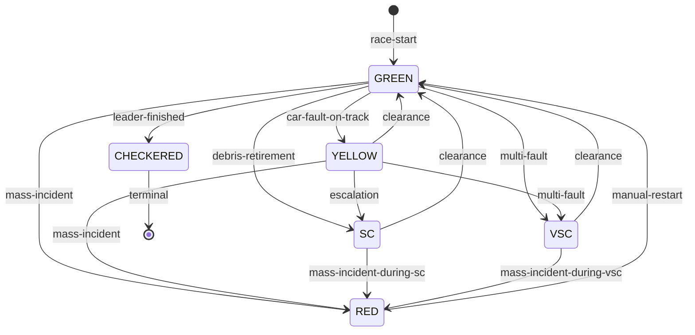

# 🏁 Race Control — Design della Logica di Gestione Flag

Documento di riferimento per la **Fase 4** del piano di implementazione.
Definisce architettura, trigger, macchina a stati delle flag, e integrazione
con il simulatore multi-car della Fase 3.

> Riferimenti:
> - [simulator-architecture.md](simulator-architecture.md) §8 (Coupling con Race Control)
> - [mqtt-topics.md](mqtt-topics.md) §4.4 (payload flag)
> - [flag.schema.json](../schemas/flag.schema.json) (schema di validazione)

---

## 1. Panoramica

Race Control è il modulo che gestisce lo **stato globale della gara** attraverso
le flag (bandiere). A differenza degli eventi a livello auto (gestiti dalla FSM
in `car/fsm.js`), le flag di Race Control influenzano **tutte le auto
contemporaneamente** e hanno priorità sulle decisioni individuali.

```
                    ┌─────────────────────────────────────────┐
                    │           RaceController                 │
                    │                                         │
  Orchestrator ────▶│  ┌────────────┐   ┌────────────────┐   │
    tick()          │  │ FlagState   │   │ AutoTriggers   │   │
                    │  │ (FSM flag)  │◀──│ (valutazione)  │   │
                    │  └─────┬──────┘   └───────┬────────┘   │
                    │        │                   │            │
                    │        ▼                   │            │
  MQTT subscriber──▶│  forceFlag()          evaluateTriggers()│
  (flag esterne)    │                                         │
                    └─────────────┬───────────────────────────┘
                                  │
                                  ▼
                          publishFlag() → MQTT broker
                          (QoS 1, retained)
```

### Flusso per tick

1. L'**Orchestrator** invoca `raceController.tick(cars, raceState)` PRIMA
   di aggiornare le auto.
2. Il RaceController valuta i **trigger automatici** (§3) in ordine di
   priorità.
3. Se un trigger scatta, `changeFlag()` effettua la transizione nella
   macchina a stati delle flag (§2).
4. Se la flag è cambiata, il payload MQTT viene restituito all'Orchestrator
   che lo pubblica su `f1/simulation/{raceId}/race-control/flags`.
5. Il contesto flag (`activeFlag`, `activeFlagSector`) viene poi passato a
   ogni `Car.tick()` tramite `ctx`.

### Flusso per trigger manuale

1. Il **RaceControlSubscriber** riceve un messaggio su
   `f1/simulation/{raceId}/race-control/flags` (da Node-RED, CLI, ecc.).
2. Il messaggio viene passato a `raceController.forceFlag()`.
3. Se la transizione è ammessa, la flag viene aggiornata.

---

## 2. Macchina a stati delle flag

### 2.1 Flag supportate

| Flag | Tipo | Effetto |
|------|------|---------|
| `GREEN` | Globale | Gara attiva, nessuna restrizione |
| `YELLOW` | Locale (settore) | Rallentamento nel settore, no DRS |
| `RED` | Globale | Gara sospesa, tutte le auto frenano |
| `SC` | Globale | Safety Car: velocità ridotta + compattamento |
| `VSC` | Globale | Virtual Safety Car: velocità limitata uniforme |
| `CHECKERED` | Globale | Fine gara, abilita transizione → FINISHED |

### 2.2 Grafo delle transizioni



### 2.3 Regole di transizione

| Da | A | Ammessa? | Note |
|------|-----------|---------|------|
| GREEN | YELLOW | ✅ | Singolo pericolo localizzato |
| GREEN | SC | ✅ | Detrito/ritiro |
| GREEN | VSC | ✅ | Multi-fault |
| GREEN | RED | ✅ | Incidente multiplo |
| GREEN | CHECKERED | ✅ | Leader ha finito |
| YELLOW | GREEN | ✅ | Clearance dopo pericolo rimosso |
| YELLOW | SC | ✅ | Escalation se la situazione peggiora |
| YELLOW | VSC | ✅ | Escalation |
| YELLOW | RED | ✅ | Escalation grave |
| SC | GREEN | ✅ | Clearance dopo durata minima |
| SC | RED | ✅ | Incidente durante SC |
| VSC | GREEN | ✅ | Clearance dopo durata minima |
| VSC | RED | ✅ | Incidente durante VSC |
| RED | GREEN | ✅ | Restart (solo manuale) |
| CHECKERED | * | ❌ | Stato assorbente |

La `YELLOW` è l'unica flag che può avere un `sector` specifico (1-3).
Tutte le altre sono globali (`sector = null`).

---

## 3. Trigger automatici

I trigger sono valutati in ordine di **priorità decrescente**. Il primo
che scatta produce un cambio di flag; i successivi vengono ignorati per
quel tick.

### 3.1 Tabella priorità

| # | Trigger | Da | A | Condizione | Config |
|---|---------|------|------|-----------|--------|
| 1 | `CHECKERED` | !CHECKERED | CHECKERED | `leaderLap >= totalLaps` | — |
| 2 | `RED_FLAG` | !RED, !CHECKERED | RED | `count(FAULT+RETIRED) >= threshold` | `massIncidentThreshold: 3` |
| 3 | `SC` | GREEN, YELLOW | SC | Nuovo ritiro con prob. casuale | `retirementScProbability: 0.40` |
| 4 | `VSC` | GREEN, YELLOW | VSC | `count(FAULT) >= threshold` | `multiFaultVscThreshold: 2` |
| 5 | `YELLOW` | GREEN | YELLOW | `count(FAULT) == 1` | — |
| 6 | `CLEARANCE` | SC, VSC, YELLOW | GREEN | Durata min. elapsed + 0 FAULT | `scMinDurationS: 30`, `vscMinDurationS: 20`, `yellowMinDurationS: 10` |

### 3.2 Dettagli trigger

#### CHECKERED (priorità massima)

Scatta quando il **leader** (auto non-RETIRED con il `lap` più alto)
raggiunge `totalLaps`. Non è bloccato da nessun'altra condizione.
Effetto: la flag CHECKERED abilita la transizione RUNNING/PIT → FINISHED
nella FSM di ogni auto.

#### RED FLAG (incidente multiplo)

Quando 3 o più auto sono contemporaneamente in stato FAULT o RETIRED,
la direzione gara interrompe la corsa. Questo previene situazioni
pericolose con troppi mezzi fermi in pista.

La RED FLAG richiede un **clearance manuale** per tornare a GREEN
(restart). Non c'è auto-clearance per RED.

#### SAFETY CAR

Ogni nuovo ritiro (transizione a RETIRED) ha una probabilità
configurabile (default 40%) di causare Safety Car. La logica:

1. Trova le auto appena ritirate (non ancora processate nel tracker).
2. Per ognuna, estrae un numero casuale dal PRNG.
3. Se `rng() < retirementScProbability` → SC attivata.

La SC non viene ri-attivata per lo stesso ritiro (il tracker tiene
traccia degli ID già processati).

#### VIRTUAL SAFETY CAR

Attivata quando 2+ auto sono contemporaneamente in FAULT. A differenza
della SC (causata da detriti di un ritiro), la VSC è per pericoli
diffusi ma meno gravi.

#### YELLOW FLAG (locale)

Una singola auto in FAULT causa una yellow flag nel settore dove si
trova (`car.currentSector`). Questo è il caso meno grave: un solo
pericolo localizzato.

#### CLEARANCE (ritorno a GREEN)

Dopo SC, VSC o YELLOW, la direzione gara riporta GREEN quando:
1. È trascorsa la **durata minima** della flag (30s per SC, 20s per
   VSC, 10s per YELLOW).
2. **Nessuna auto** è ancora in stato FAULT (il pericolo è stato
   rimosso).

---

## 4. Configurazione

Tutti i parametri dei trigger sono in `config/default.js` sotto la
chiave `raceControlTriggers`:

```js
raceControlTriggers: {
  retirementScProbability: 0.40,   // prob. SC per ogni ritiro
  multiFaultVscThreshold: 2,       // N auto in FAULT → VSC
  massIncidentThreshold: 3,        // N auto FAULT+RETIRED → RED FLAG
  scMinDurationS: 30,              // durata minima SC
  vscMinDurationS: 20,             // durata minima VSC
  yellowMinDurationS: 10,          // durata minima YELLOW
}
```

Questi valori producono un comportamento realistico con 10 auto su 15
giri: attese ~0-1 SC per gara (in base ai ~2.4 ritiri attesi
dall'engine failure probability), con escalation a RED solo in casi
molto rari di incidenti multipli.

---

## 5. Mappa dei moduli

```
simulator/src/race-control/
├── flag-state.js         # Macchina a stati delle flag (pura)
│                         # FLAGS, changeFlag(), canTransitionFlag()
│
├── triggers.js           # Trigger automatici (puro)
│                         # evaluateTriggers(), countCarsInState()
│
├── race-controller.js    # Controller integrato (stateful)
│                         # tick(), forceFlag(), buildFlagContext()
│
└── subscriber.js         # MQTT subscriber per flag esterne
                          # Riceve da Node-RED/CLI → forceFlag()
```

### Principi di design

- **flag-state.js** e **triggers.js** sono **moduli puri** (niente I/O,
  niente mutazioni degli input). Facilita il testing.
- **race-controller.js** integra i moduli puri e mantiene lo stato.
  Non fa I/O direttamente: ritorna i payload MQTT all'Orchestrator.
- **subscriber.js** è l'unico modulo con effetti collaterali MQTT.

---

## 6. Integrazione con l'Orchestrator

### 6.1 Tick modificato (prima → dopo)

```diff
 _tick() {
   // ...dt, timestamp, tickCount...

   this._updateLeaderLap();

+  // RACE CONTROL: valuta trigger automatici PRIMA delle auto
+  const rcResult = this.raceController.tick(this.cars, {
+    leaderLap: this._leaderLap,
+    totalLaps: this.totalLaps,
+    nowS: this._simulatedTimeS,
+    timestamp,
+  });
+
+  if (rcResult.flagChanged && rcResult.flagPayload) {
+    this.publisher.publishFlag(rcResult.flagPayload);
+  }

   // Contesto globale del tick
   const ctx = {
     raceId: this.raceId,
     timestamp,
     totalLaps: this.totalLaps,
     checkeredActive: this._checkeredSent,
     leaderLap: this._leaderLap,
+    activeFlag: flagCtx.flag,
+    activeFlagSector: flagCtx.sector,
   };

   // Tick di tutte le auto (con contesto flag)
   for (const car of this.cars) { ... }
 }
```

### 6.2 Bootstrap (index.js)

```js
const rcSubscriber = new RaceControlSubscriber({
  mqttClient: client,
  raceId: config.raceId,
  raceController: orchestrator.raceController,
  logger: log,
});
rcSubscriber.start();
```

### 6.3 Publisher — nuovo metodo

```js
publishFlag(payload) {
  const topic = `f1/simulation/${this.raceId}/race-control/flags`;
  this._publish(topic, payload, { qos: 1, retain: true });
}
```

---

## 7. Payload MQTT

Conforme a `schemas/flag.schema.json`:

```json
{
  "timestamp": "2026-04-27T14:40:12.000Z",
  "raceId": 1,
  "flag": "SC",
  "active": true,
  "sector": null,
  "reason": "debris-retirement:car-11"
}
```

- `active: true` sempre quando una flag viene attivata.
- `sector`: numero di settore (1-3) solo per YELLOW, `null` per flag globali.
- `reason`: stringa descrittiva del motivo del cambio.
- Pubblicato con **QoS 1** e **retain = true** (il subscriber che si
  connette in ritardo vede subito lo stato corrente).

---

## 8. Test

Test unitari in `scripts/test-race-control.js` (25 test):

| Gruppo | Test |
|--------|------|
| **Flag State** | initialState, valid/invalid transitions, terminal state, sector handling |
| **Triggers** | CHECKERED, RED, SC (prob hit/miss), VSC, YELLOW, clearance (ok/blocked), terminal no-op |
| **Controller** | init, forceFlag valid/invalid, tick auto-CHECKERED, tick auto-RED, history |

Eseguire: `node scripts/test-race-control.js`

---

## 9. Open points (da chiudere nelle sotto-task successive della Fase 4)

- [ ] **Effetto flag sulle auto**: implementare la modulazione di
  `targetSpeed` in base alla flag attiva (§8.2 dell'architettura del
  simulatore). Task: "Implementare la logica di influenza delle flag
  sul comportamento delle auto".
- [ ] **Safety Car compattamento**: algoritmo di riduzione gap tra le
  auto durante SC. Task: "Implementare il Safety Car (SC)".
- [ ] **VSC delta time**: logica di lap time forzato durante VSC.
  Task: "Implementare il Virtual Safety Car (VSC)".
- [ ] **Test scenari combinati**: SC durante pit stop, RED flag con
  restart, ecc. Task: "Testare scenari combinati".
